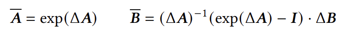
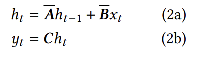

# State Space Models (SSM) - Motivation & Mamba

Mamba Paper: https://arxiv.org/pdf/2312.00752

In this blog post I'll discuss SSM motivation, explore differences with RNNs/LSTMs and Transformers.

## RNN:
* O(n) in memory during training (store gradients for each state)
* O(1) in memory during inference
* O(n) in compute during training
* O(n) in compute during inference
* Bad for training - we cannot parallelize w.r.t tokens during training. In given input sequence, we know its corresponding output sequence, but we still must compute 1 by 1. (compare with transformers which can parallelize w.r.t tokens)
Vanishing/exploding gradients

## Transformers
* O(n^2) in memory and computation during training. Terrible. 
* O(N) in memory and computation (think how many dot products we do, its o(n)) during inference using kv-cache 
We can easily parallelize during training the whole sequence computation.

SSM offers the ideal combination:
1) Easy training parallelization (like Transformers) for handling long sequences in memory (like RNNs).
2) Constant computation/memory for each token inference.

## SSM basics and discretization
In continous time (CT) we have:
$$h'(t) = Ah(t) + Bx(t) \quad (1a)$$
$$y(t) = Ch(t) \quad (1b)$$
If we discretize using Euler's method: $\frac{h(t+\Delta) - h(t)}{\Delta} = h'(t)$  we would get:
$$h(t+\Delta) \approx (I+\Delta A)h(t) + \Delta Bx(t) = \bar Ah(t) + \bar Bx(t)$$
$$y(t+\Delta) = Ch(t+\Delta) \quad$$

In the paper they use Zero order hold defined by:

With this we write:

